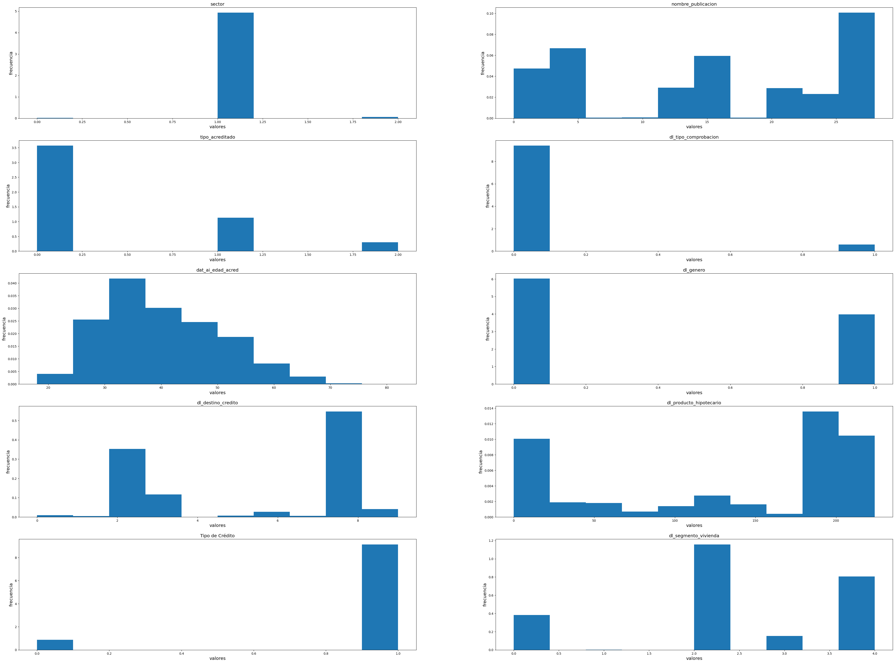
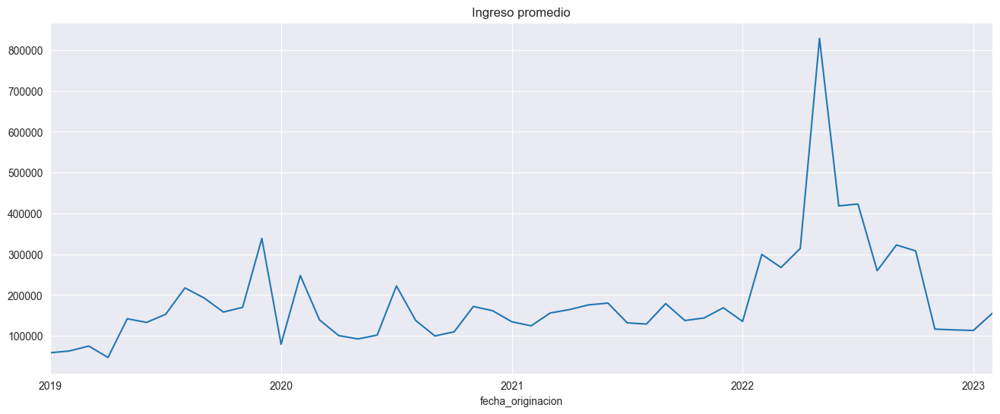
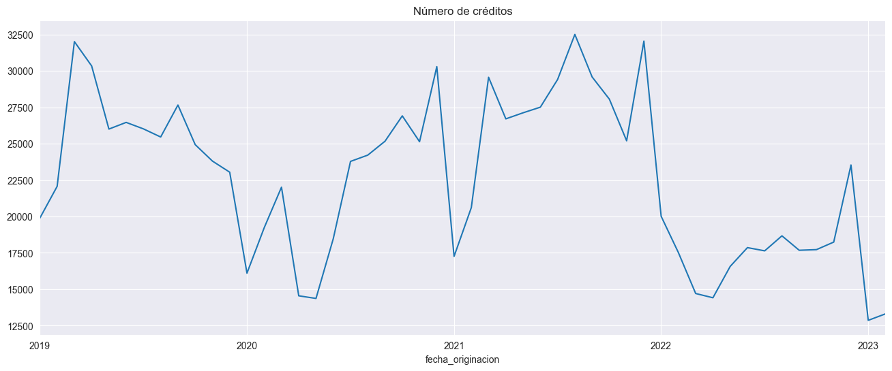

# Modelos de inferencia bayesiana para pronosticar tasas de interés hipotecarias asignadas en México

# Introducción

Este proyecto busca modelar la tasa otorgada a créditos hipotecarios con base en diversas características del acreditado y el acreedor en México de 2019 a 2023.

La base de datos consiste en una cartera de vivienda de créditos marginales, publicada por la Comisión Nacional Bancaria y de Valores (CNBV). Incluye más de 1.1 millones de datos de créditos otorgados a la vivienda durante 2019 a 2023. 

Para estos modelos, se consideró incluir dentro del modelo la posición geográfica del centroide del municipio de la vivienda del acreditado, así como la evolución en el tiempo por el cambio de tasas de interés en el contexto internacional.

También se incluyeron variables categóricas de tipo de crédito, tipo de vivienda, tipo de acreditado (proxy lejano de ocupación), género, edad, segmento de vivienda, entre otros.

# Modelos:

Se utilizaron tres tipos de modelos:
- Modelos base
- Modelos jerárquicos
- Modelos dinámicos

# Resultados

# Análisis y conclusiones

# Anexos

# EDA:

Distribución por variables:
- *sector*: se observa que la casi todos los créditos fueron otorgados por banca múltiple.
- *tipo de acreditado*: la mayoría de los acreditados son asalariados privados, mientras que otros pocos son asalariados públicos
- *tipo de comprobación*: casi todos los créditos se otorgan a asalariados.
- *edad del acreditado*: la distribución de la edad está sesgada a la derecha, con un rango de 20 a 70 años; la moda está poco después de los 30 años.
- *género*: la mayoría de los acreditados son hombres
- *destino de crédito*: la moda de los destinos de los créditos otorgados se usan para adquisición de vivienda nueva o mejoras a vivienda
- *tipo de crédito*: la mayoría se usan sin cofinanciamiento
- *segmento de vivienda*: la mayoría se otorgan para vivienda media o residencial, o bien para mejoras vía banca de desarrollo

Se observa que el ingreso promedio de los acreditados tuvo su pico a inicios de 2022, para lluego regresar a su rango normal de 100 mil - 200 mil

El número de créditos otorgados tocó su mínimo desde al menos 2019 a inicios de 2023.

## CDMX

Las alcaldías con más créditos otorgados durante los últimos cinco años han sido alcaldías céntricas: Benito Juárez, Cuauhtémoc, Miguel Hidalgo, Álvaro Obregón y Coyoacán.

En Xochimilco, Cuajimalpa y Magdalena Contreras se ha dado el mayor enganche promedio. En las colonias del oriente se da menor enganche promedio.

Las alcaldías con mayor monto promedio inicial son las accidentales, mientras que las colonias orientales tuvieron el menor monto promedio inicial del periodo.

# Calidad de convergencia y tests de cadenas

# Tests especificos para modelos geograficos-dinamicos

# Referencias

- Comisión Nacional Bancaria y de Valores, *Cartera de crédito. Créditos a la vivienda, instructivo de llenado*, 2016. 
- BE/Bi 103 b: Statistical Inference in the Biological Sciences, *Regression with MCMC*, Github repository, https://bebi103b.github.io/lessons/11/regression_with_stan.html
- Johnson, A. A., Ott, M. Q., & Dogucu, M. (2022). Bayes rules!: an introduction to applied Bayesian modeling. CRC Press.
- Xie, Y; Dervieux, C, et al (2022). R Markdown Cookbook, notes from Github repository, https://github.com/rstudio/bookdown
