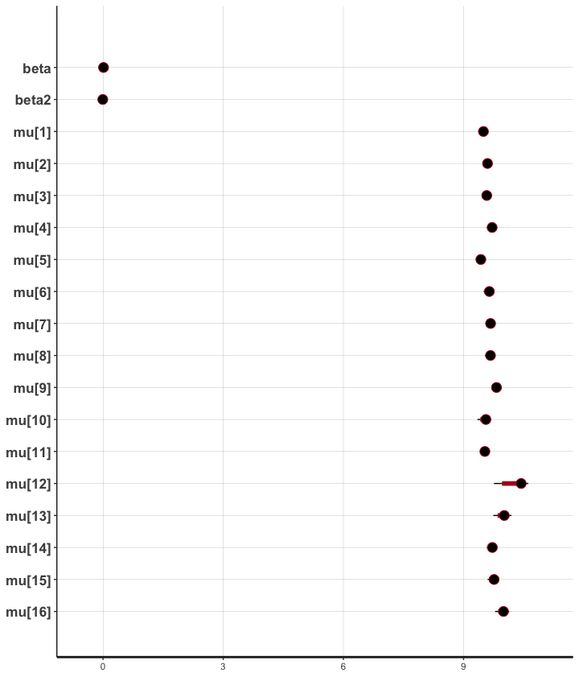

```{r setup, include=FALSE}
knitr::opts_chunk$set(echo = FALSE)
```
\tableofcontents
\newpage

# Introducción

Este proyecto busca modelar la tasa otorgada a créditos hipotecarios con base en diversas características del acreditado y el acreedor en México durante el 2022. En particular se buscó averiguar el impacto que tienen la localización del inmueble comprado en la tasa de interés y si esta influencia es mayor o menor a la de las caracterísitcas del acreditado.

La base de datos consiste en una cartera de vivienda de créditos marginales, publicada por la Comisión Nacional Bancaria y de Valores (CNBV)^[@source]. Incluye más de 1.1 millones de datos de créditos otorgados a la vivienda durante 2019 a 2023. Sin embargo, debido a las limitantes de computo y tiempo, hemos decidido solo utilizar datos de una entidad (CDMX) y un año(2022). Aunque bien se podría replicar el código para cualquier otra entidad y cualquier otro año. 

Los datos son abiertos, públicos y accesibles y se originan de la compilación de documentos que por ley los bancos deben llenar y entregar a la CNBV cuándo otorguen un crédito hipotecario.^[@cnbv]

# Antecedentes

Existen diversos determinantes en el nivel de tasa de interés que se le ofrece a una persona. Algunos son factores personales como el *score* crediticio o el ingreso; algunos otros son coyunturales como las tasas de referencia bancarias y demás variables macroeconómicas^[@cnbv]; y muchos otros son estructurales, como el género^[@gender], la edad^[@age] y la localización de origen o de compra del inmueble.

Es decir, modelar las tasas de interés nos presenta una oportunidad de poder construir un modelo lineal generalizado que contemple parámetros específicos de cada situación (como la localidad de compra del inmueble) combinandolos con factores estructurales, como el género y edad de la persona.

# Modelos:

Partimos de una misma estructura general para todos los modelos que comparamos: la tasa de interés se puede explicar por la edad y género del acreditado más un parámetro $\beta_0$. Conforme aumenta la complejidad del modelo veremos que la $\beta_0$ va adquiriendo distinto sentido, interpretación e importancia.

## Estructura general

$$Y \sim \beta_0 + \beta_1\cdot x_1+ \beta_2 \cdot x_2$$

## Diseño

Se compararon 3 modelos

- Modelo sencillo (pooled)
- Modelos jerárquico simple
- Modelos jerárquico centrado

# Resultados

### Modelo sencillo


# Análisis y conclusiones


\newpage

# Anexo estadístico

# EDA:

Distribución por variables:
- *sector*: se observa que la casi todos los créditos fueron otorgados por banca múltiple.
- *tipo de acreditado*: la mayoría de los acreditados son asalariados privados, mientras que otros pocos son asalariados públicos
- *tipo de comprobación*: casi todos los créditos se otorgan a asalariados.
- *edad del acreditado*: la distribución de la edad está sesgada a la derecha, con un rango de 20 a 70 años; la moda está poco después de los 30 años.
- *género*: la mayoría de los acreditados son hombres
- *destino de crédito*: la moda de los destinos de los créditos otorgados se usan para adquisición de vivienda nueva o mejoras a vivienda
- *tipo de crédito*: la mayoría se usan sin cofinanciamiento
- *segmento de vivienda*: la mayoría se otorgan para vivienda media o residencial, o bien para mejoras vía banca de desarrollo


Se observa que el ingreso promedio de los acreditados tuvo su pico a inicios de 2022, para lluego regresar a su rango normal de 100 mil - 200 mil


El número de créditos otorgados tocó su mínimo desde al menos 2019 a inicios de 2023.


## CDMX

Las alcaldías con más créditos otorgados durante los últimos cinco años han sido alcaldías céntricas: Benito Juárez, Cuauhtémoc, Miguel Hidalgo, Álvaro Obregón y Coyoacán.


En Xochimilco, Cuajimalpa y Magdalena Contreras se ha dado el mayor enganche promedio. En las colonias del oriente se da menor enganche promedio.


Las alcaldías con mayor monto promedio inicial son las accidentales, mientras que las colonias orientales tuvieron el menor monto promedio inicial del periodo.


# Calidad de convergencia y tests de cadenas

## Modelo pooled

En cuanto al parámetro de efectos fijos $\beta = \gamma + \tau + \beta_{raw,j}, y =1,...,J $ en el j-ésimo grupo, se observa que la distribución posterior del grupo J=1 presentó mayor intervalo de confianza que aquélla del grupo J=2.


En cuanto a los parámetros asignados a las categorías específicas al grupo, se observa que, para cada categoría, ambas cadenas oscilaron en un rango entre 9.3 y 9.8, en tanto que la segunda cadena presentó menor varianza
![Diagnóstico de categorías específicas al grupo] (diagnostico.png)

Las cadenas de las betas 

en cuanto a las primeras 4  variables categóricas mu, se observa que la segunda cadena presentó menor varianza, en las cuatro. 

# Tests especificos para modelos geograficos-dinamicos


# Modelos

- Software: Stan
- Lenguaje: R
- Procesador: ARM

## Pooled

### Parámetros

- thin = 4
- chains = 2
- warmup: 500
- iter: 5,000
- Algoritmo de muestreo: NUTS (No-U-Turn sampler)

**Agregar en látex modelo

### Diagnóstico

Se observa que las cadenas del modelo han convergido. La convergencia de las cadenas es un indicador importante de que el muestreador ha explorado adecuadamente el espacio de parámetros.

RStan utiliza el diagnóstico R-hat (también conocido como factor de escala de Gelman-Rubin) para evaluar la convergencia de las cadenas. Un valor de R-hat cercano a 1, generalmente inferior a 1.05, indica que las cadenas han convergido y que los resultados del modelo son confiables.

La convergencia exitosa de las cadenas sugiere que el algoritmo NUTS ha explorado de manera efectiva el espacio de parámetros. Esto implica que los resultados obtenidos son estables y consistentes, y que las estimaciones de los parámetros son confiables para su interpretación.

La convergencia de las cadenas es esencial para asegurar que las inferencias y conclusiones basadas en el modelo sean válidas. 

{width=50%}

{width=50%}

{width=50%}

{width=50%}
\newpage

## Partial pooled

### Parámetros

- thin = 6
- chains = 2
- warmup: 3,000
- iter: 10,000
- Algoritmo de muestreo: NUTS (No-U-Turn sampler)

**Agregar en látex modelo

### Diagnóstico

Se observa que las cadenas del modelo no han convergido. Esto se observa desde el calculo de Rhat y también en los gráficos de las cadenas, para mejorar esto se debería de incrementar el número de pre-calentamiento y el número de iteraciones, por temas de computo no se pudo realizar, aunque esto debería de hacerse para que las estimaciones de los parámetros sean confiables para su interpretación.

{width=50%}

{width=50%}

{width=50%}

{width=50%}

\newpage

## Comparación de resultados LOO (Leave-one-out)

En la tabla de comparación de resultados del método LOO (Leave-One-Out), se presentan los siguientes valores para los modelos "partial" y "pooled":

- elpd_diff: La diferencia en log densidad predictiva puntual esperada (elpd) entre los modelos. Un valor positivo indica que el modelo "partial" tiene un mejor desempeño, mientras que un valor negativo favorece al modelo "pooled". En este caso, el elpd_diff para "partial" es 0.00, lo que indica que no hay diferencia en el rendimiento predictivo en comparación con el modelo "pooled".
- se_diff: El error estándar asociado al elpd_diff. Un valor más pequeño sugiere una estimación más precisa. El modelo "partial" tiene un se_diff de 0.00, lo que indica que no hay incertidumbre en el elpd_diff.
- p_loo: La probabilidad de que el modelo sea el mejor en términos de rendimiento predictivo dentro del conjunto de modelos considerados. El valor para el modelo "partial" es 17.72.
- se_p_loo: El error estándar asociado a la p_loo. Para el modelo "partial", el valor es 0.99.
- looic: La información de información esperada fuera de la muestra (LOOIC) del modelo. Para el modelo "partial", el valor es 44156.22.
- se_looic: El error estándar asociado al looic. Para el modelo "partial", el valor es 478.29.

En resumen, según los resultados de la comparación LOO, el modelo "partial" muestra un mejor desempeño no tan significativo que el modelo "pooled". 

|        | elpd_diff| se_diff|  elpd_loo| se_elpd_loo| p_loo| se_p_loo|    looic| se_looic|
|:-------|---------:|-------:|---------:|-----------:|-----:|--------:|--------:|--------:|
|partial |      0.00|    0.00| -22078.11|      239.14| 17.72|     0.99| 44156.22|   478.29|
|pooled  |    -47.23|   10.48| -22125.34|      238.08| 10.55|     0.94| 44250.68|   476.16|


{width=50%}

\newpage

# Apendice

## Modelo en Stan 

### Pooled 

``` 
data {
  int<lower=1> N;                              // Number of observations
  vector[N] tasa_ponderada;                    // Response variable
  vector[N] dl_generoMasculino;                // Predictor: binary indicator for male gender
  vector[N] dat_ai_edad_acred;                  // Predictor: additional data
}

parameters {
  real alpha;                                  // Intercept
  real beta1;                                  // Coefficient for predictor dl_generoMasculino
  real beta2;                                  // Coefficient for predictor dat_ai_edad_acred
  real<lower=0> sigma;                         // Standard deviation of the residuals
}

model {
  alpha ~ normal(0, 10);                       // Prior for alpha
  beta1 ~ normal(-2, 2);                       // Prior for beta1
  beta2 ~ normal(-2, 2);                       // Prior for beta2
  sigma ~ cauchy(0, 5);                         // Prior for sigma
  
  for(n in 1:N){
    tasa_ponderada[n] ~ normal(alpha + beta1 * dl_generoMasculino[n] + beta2 * dat_ai_edad_acred[n], sigma); //Likelihood
  }
}

generated quantities {
  vector[N] y_pred;
  vector[N] log_lik;
  
  for (i in 1:N) {
    y_pred[i] = normal_rng( alpha + beta1 * dl_generoMasculino[i] + beta2 * dat_ai_edad_acred[i], sigma);
    log_lik[i] = normal_lpdf(tasa_ponderada[i] | alpha + beta1 * dl_generoMasculino[i] + beta2 * dat_ai_edad_acred[i], sigma);
  }
}
``` 

### Partial 

``` 
data {
  int<lower=0> N;               // Number of observations
  vector[N] tasa_ponderada;   // Response variable
  vector[N] genero;          // Response variable (dummy)
  vector[N] dat_ai_edad_acred;  // Age
  int<lower=1> J_1;               // Number of groups
  int<lower=1, upper=J_1> index_1[N]; // Grouping variable for each observation
}

parameters {
  vector[J_1] mu;                 // Group-specific means
  real<lower=0> sigma_indi;          // Common standard deviation
  real<lower=0> sigma_group;          // Common standard deviation
  real alpha; 
  real beta;                  // Coefficient for predictor
  real beta2;
  real sigma;

}

model {
  // Priors
  alpha ~ normal(0, 20);
  mu ~ normal(0, 20);
  beta ~ normal(-2, 2);
  beta2 ~ normal(-2, 2);
  sigma ~ cauchy(0, 5);

  // Likelihood
  for(n in 1:N){
    tasa_ponderada[n] ~ normal(mu[index_1[n]] + beta * genero[n] + beta2 * dat_ai_edad_acred[n], sigma); // Variance within state j
  }

}

generated quantities {
  vector[N] y_pred;
  real log_lik[N];
  
  for (n in 1:N) {
    y_pred[n] = normal_rng(mu[index_1[n]] + beta * genero[n] + beta2 * dat_ai_edad_acred[n], sigma);
    log_lik[n] = normal_lpdf(tasa_ponderada[n] | mu[index_1[n]] + beta * genero[n] + beta2 * dat_ai_edad_acred[n], sigma);
  }
}
``` 

# Referencias

- Comisión Nacional Bancaria y de Valores, *Cartera de crédito. Créditos a la vivienda, instructivo de llenado*, 2016. 
- BE/Bi 103 b: Statistical Inference in the Biological Sciences, *Regression with MCMC*, Github repository, https://bebi103b.github.io/lessons/11/regression_with_stan.html
- Johnson, A. A., Ott, M. Q., & Dogucu, M. (2022). Bayes rules!: an introduction to applied Bayesian modeling. CRC Press.
- Xie, Y; Dervieux, C, et al (2022). R Markdown Cookbook, notes from Github repository, https://github.com/rstudio/bookdown
